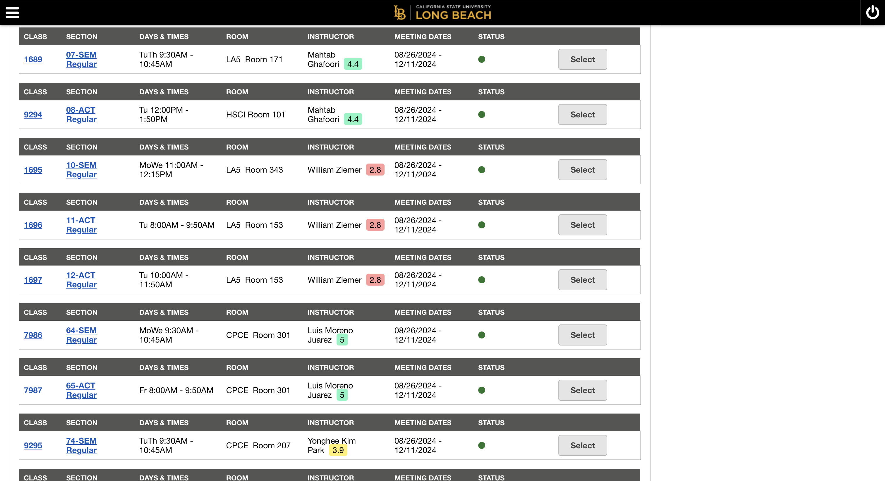

# Rate My CSULB Professors

## Overview
The **Rate My CSULB Professors Chrome Extension** enhances your experience while selecting professors by providing quick access to Rate My Professor (RMP) ratings directly in CSULB's course registration platforms.

### Features:
- Displays the professor's overall rating next to their name.
- Shows additional details ("Would Take Again" %, Difficulty rating, and Comments) in a pop-up.
- Provides a streamlined interface for quick decision-making.

---

## Installation

1. **Download the Extension Files**
   - Clone this repository:
     ```bash
     git clone https://github.com/chuckmilton/Rate-My-CSULB-Professors.git
     ```
   - Navigate to the project folder.

2. **Enable Developer Mode in Chrome**
   - Open Chrome and navigate to `chrome://extensions`.
   - Toggle on "Developer mode" (top right corner).

3. **Load the Extension**
   - Click on **Load unpacked**.
   - Select the project folder you downloaded.

4. **Activate the Extension**
   - The extension will now be available in your Chrome toolbar.
   - Pin the extension for easy access.

---

## How to Use

1. Visit any **CSULB's MyCSULB Student Center or Schedule Planner**.
2. The professor's **RMP rating** will automatically appear to the right of their name.
3. Click on the rating to see:
   - **Would Take Again %**
   - **Difficulty Rating**
   - **Top Comments**

---

## Screenshots

**Example of Ratings Displayed:**


**Pop-up Information (Clicking on rating badge):**


---

## Contact
Developed by **Charles Milton**  
Email: [chuckmilton123@gmail.com](mailto:charlesmiltoncs@gmail.com)  
Website: [chuckmilton](https://chuckmilton.com/)

---

Enjoy using Rate My CSULB Professors to simplify your course registration process!
